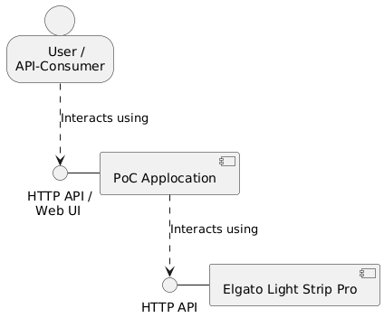

# Elgato Light Strip Pro PoC
This project is a proof of concept (PoC) for controlling the Elgato Light Strip Pro using its REST API.

> [!IMPORTANT]  
> This PoC is not finished yet. It is still in development.
> You can already control the light strip using the REST API, 
> but the code is not yet optimized and the documentation is not complete.